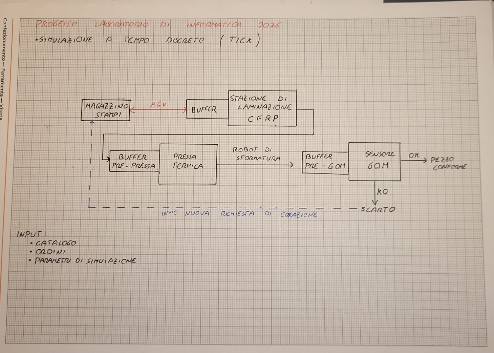

# lab_informatica_industriale_cella_meccatronica_Basset_Bernabei_Canola_Cerentin
Simulatore in C di una cella meccatronica flessibile per movimentazione, lavorazione e smistamento di oggetti, con controllo, buffer, sensori, attuatori, logging, statistiche e scenari configurabili

## Layout dell'Impianto e Flusso Logico

Il sistema simula il flusso lineare di un reparto produttivo avanzato per materiali compositi, integrando risorse di trasporto fisse e mobili, stazioni di lavorazione e buffer di accumulo.



### Flusso del Processo:
1. **Order Input (CSV):** Gli ordini giornalieri vengono letti da un file CSV contenente ID, tipo di componente e parametri fisici.
2. **AGV Transport:** Un veicolo a guida autonoma (AGV) preleva lo stampo metallico dal magazzino e lo immette sulla linea.
3. **Lamination Station:** Stazione di stratificazione in cui viene depositato il tessuto di carbonio e inserita l'anima termoespandente.
4. **Buffer 1 (Pre-Press Queue):** Coda di accumulo FIFO a capacità limitata prima della pressa.
5. **Thermal Press (Curing):** Stazione bloccante che esegue il ciclo di cura termico basato sui parametri specifici del pezzo.
6. **De-molding Robot:** Un braccio antropomorfo apre lo stampo, separa il pezzo finito e ricolloca lo stampo sull'AGV per il ritorno in magazzino.
7. **Buffer 2 (Pre-Inspection Queue):** Buffer di raffreddamento a capacità limitata.
8. **Quality Control (GOM):** Un sistema di scansione ottica 3D misura lo scostamento dal modello CAD geometrico, classificando il pezzo come Conforme (OK) o Scarto (KO).

---

## 💻 Architettura del Software

Il progetto adotta un approccio rigorosamente modulare:

* `src/main.c`: Gestisce il ciclo principale (clock discreto) e l'evoluzione temporale della simulazione.
* `src/parser.c` / `include/parser.h`: Modulo dedicato al parsing e alla validazione robusta dei file di configurazione e degli ordini CSV.
* `src/simulazione.c` / `include/cella.h`: Contiene le definizioni delle `struct` e le funzioni di gestione delle code (liste concatenate) e della fisica dei componenti.
* `src/controllore.c` / `include/controllore.h`: Il "cervello" del sistema che interroga i sensori (inclusi i comportamenti non ideali) e aziona gli attuatori.
* `src/logger.c` / `include/logger.h`: Gestisce la scrittura del log eventi in tempo reale e la generazione del report statistico finale.
* `test/`: Suite di test unitari sviluppati con il framework **Unity**.

---

## Come Compilare ed Eseguire

### Requisiti
* GCC o un qualsiasi compilatore compatibile C99
* CMake (versione 3.10 o superiore)
* Valgrind (per il controllo della memoria)

### Compilazione con CMake
Dalla cartella principale del progetto, eseguire:
```bash
mkdir build
cd build
cmake ..
make
